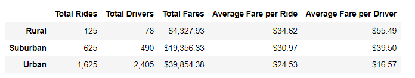
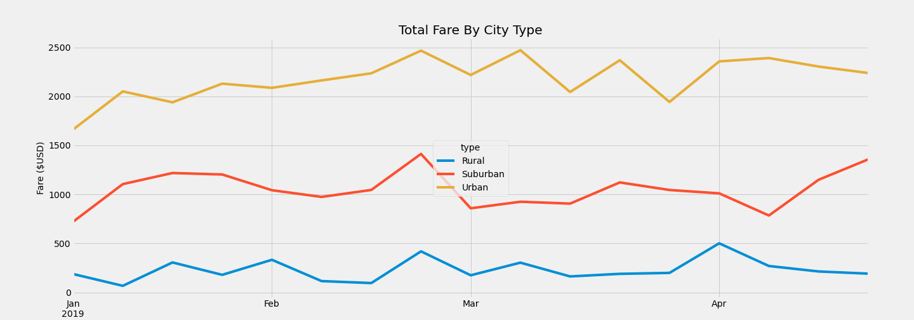

# Plotting Pyber
## Overview of Analysis
Pyber requested assistance in make well-informed changes to their current set-up so they can be more accessible and affordable to their customers. By merging both the city and fare data they provided, I was able to create data frames and data series, that could be portrayed in graphs using Python, Pandas, and Matplotlib.  These graphics help us to see the big picture and where some changes could be made for improvement as well as trends and patterns in the data. 

## Results and Visualizations
By creating data frames and data sets, I was able to extract only the information necessary to view the following ride-sharing data.
### Ride-Sharing Data

#### Total Rides

As the pie chart shows, more than half of the total rides are taken in the urban cities. Rural cities make up a very small percentage of the rides.  

#### Total Drivers

In line with the total amount of rides, 80% of the total drivers are in urban cities. While in rural areas there seems to be a significantly small number of drivers. 

#### Total Fares 

Based off the pie chart, it is no surprise that the total number of fares predominantly come from the Urban cities and very low amounts are contributed by Rural cities.  Suburban cities seem to be slightly over a 4th of total fares. 

#### Average Fare Per Ride and Driver

This table was created by merging of data frames and series to give a clear overview of all the above-mentioned data at a quick glance. Suburban Cities seem to be a middle ground while Urban cities are the biggest customer base for Pyber. Rural cities have not been utilizing Pyber as much. 

#### Total Fare By City Type

The line graph above displays the total fare by city type for Pyber by week for a couple months. As mentioned before, Suburban cities seem to be a good middle ground and stays between $800 and $1500 weekly.  Urban cities being the bulk of income, stay well above the $1500 threshold every week. Rural cities seem low but does get a spike in April – perhaps there could be a factor in the area that contributes to that such as bad weather or a popular event. 

## Summary

### Recommendations
Based off of the results, there are some data points that should be reviewed or adjusted to help with keeping rides affordable and accessible while maintaining revenue and the retention of customers. 
Urban fares are quite low; there could be a slight increase in the price urban riders pay. On the other hand, the Rural Cities fares are quite high and could be lowered slightly. They are on the higher price range, and this could be off-putting to those interested in trying the platform out.  If you were to lower the Rural Fares and Increase the Urban fares, you could possibly balance each other out financially while increasing the customer base.  
Based on the pie graph for total drivers, there is a very low number of drivers in rural areas, if you can increase your demand, you should be able to increase the number of drivers you higher for that area as well. 
These ideas are based on the data provided but other factors that contribute to the fares cost could be the distance between places in the city. In a rural area, I would imagine things are much further apart than in an urban city.  More information could be provided into how fares are determined to make a more educated decision.  
